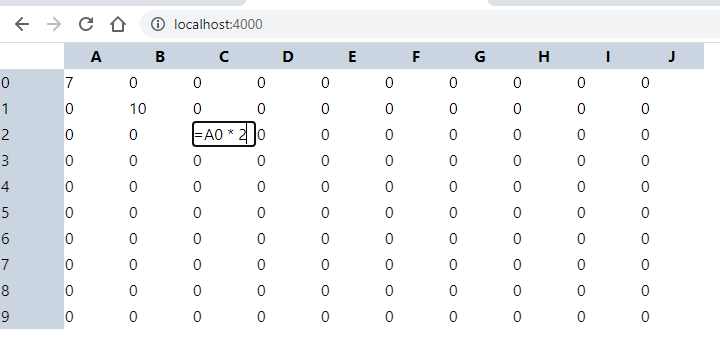

# Spreadsheet using react

[this code was based on Surma article](https://surma.dev/things/spreadsheet/)

# Problem
“Build a spreadsheet-like web app from scratch. Start simple, with a 10 by 10 grid, and add features like cell referencing as we go along.”

[]